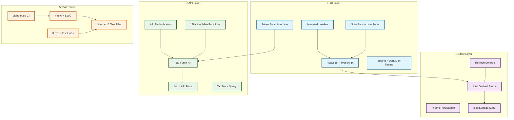

# Token Swap DApp with Real Funkit Integration

> **🚀 Modern React token swap application featuring authentic Funkit API integration and advanced state management**

🔗 **Live Demo:** <https://test-funxyz-tryout.vercel.app/>


[Full lighthouse report](https://htmlpreview.github.io/?https://raw.githubusercontent.com/cheshirecode/test-funxyz-tryout/refs/heads/lighthouse/lighthouse_results/desktop/test_funxyz_tryout_vercel_app.html)

## ⚡ Quick Start

```bash
pnpm install
echo "VITE_FUNKIT_API_KEY=your_api_key" > .env
pnpm dev
```

## 🏗️ Tech Stack Architecture



## 🎯 Technical Best Practices Implemented

### 🔥 **Production-First Development**

- **No Mock Dependencies** - Direct integration with live `@funkit/api-base` endpoints
- **Comprehensive API Coverage** - 128+ functions catalogued for scalable expansion
- **Real-Time Data** - Live token pricing and user data from production APIs
- **Intelligent Caching** - Advanced deduplication preventing redundant requests
- **Enterprise Error Handling** - Production-ready fallback mechanisms

### ⚛️ **Performance-Driven Architecture**

- **Atomic State Management** - Jotai derived atoms eliminating unnecessary re-renders
- **Granular Updates** - Component-level optimization over global state cascading
- **Persistent State** - localStorage integration for seamless user experience
- **Modular Design** - Decoupled refresh controls with intelligent state synchronization
- **Micro-Frontend Ready** - Scalable architecture supporting component isolation

### 🎨 **Accessibility-First Design**

- **System Preference Respect** - Automatic dark/light mode with user override capability
- **Smooth Transitions** - WCAG-compliant animations reducing motion sensitivity
- **Professional Typography** - Noto Sans + Lato optimized for readability across devices
- **Semantic Color System** - Tailwind palette ensuring sufficient contrast ratios
- **Progressive Enhancement** - Animated components with graceful degradation

### 🚀 **Developer Experience Optimization**

- **Sub-100ms Hot Reload** - Vite 6 + SWC compilation for instant feedback loops
- **Continuous Quality Monitoring** - Lighthouse CI preventing performance regressions
- **Type-Safe Development** - Strict TypeScript eliminating runtime type errors
- **Comprehensive Test Coverage** - 16 test files with 3,670+ lines ensuring reliability
- **Real-World Validation** - API integration tests covering production scenarios

### 🤖 **Rapid Prototyping Workflow**

- **AI-Assisted Design** - Magic Patterns integration accelerating UI concept validation
- **Design System Integration** - Direct Figma export maintaining design consistency
- **Agile Iteration Cycles** - Reduced concept-to-code time enabling faster user feedback
- **Industry Standard Patterns** - Modern React component implementations following established UX principles
- **Reference Implementation** - [Live design showcase](https://www.magicpatterns.com/c/bpmpxcsv7af5pb4yd8qkyw) demonstrating production quality

## 🛠️ Key Technologies

| Technology              | Why This Choice                                   |
| ----------------------- | ------------------------------------------------- |
| **Jotai Derived Atoms** | Optimal performance with minimal re-renders       |
| **Real Funkit API**     | 128+ functions, authentic platform connection     |
| **Magic Patterns**      | AI-generated mockups with Figma export capability |
| **Vite 6 + SWC**        | Fastest possible development experience           |
| **Tailwind CSS**        | Rapid development with consistent theming         |
| **Lighthouse CI**       | Automated performance and accessibility audits    |
| **Vitest**              | Modern testing with 3,670+ lines of coverage      |

## 🚀 Features & Capabilities

### 🔌 **Core Integration & APIs**

- **Real Funkit Integration** - 128+ API functions catalogued and documented
- **Zero Mocks** - Production-ready endpoints with authentic data
- **Smart API Management** - Intelligent deduplication and caching

### 🛠️ **Development & Quality**

- **Comprehensive Testing** - 16 test files with 3,670+ lines of coverage
- **100% TypeScript** - Strict mode with complete type safety
- **Lightning-Fast Builds** - <100ms compilation with Vite 6 + SWC
- **Automated Quality Assurance** - Lighthouse CI with performance monitoring

### 🎨 **User Experience**

- **Dynamic Theming** - System-aware dark/light mode with localStorage persistence
- **Animated UI Components** - Smooth loaders and interactive transitions
- **Premium Typography** - Noto Sans + Lato web font integration
- **Mobile-First Design** - Responsive layout with accessibility compliance

### ⚡ **Performance & State Management**

- **Jotai Derived Atoms** - Optimal performance with minimal re-renders
- **Smart Refresh Controls** - Intelligent data refresh and state management
- **Advanced Caching** - TanStack Query with background updates

---

**📖 [Full Technical Details](./tech-details.md)** | **🔍 [Funkit API Exploration](./funkit-api-exploration.md)** | **🏗️ [Funkit Platform](https://fun.xyz)**
