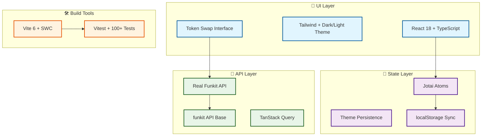

# Token Swap DApp with Real Funkit Integration

> **🚀 Modern React token swap application featuring authentic Funkit API integration and advanced state management**

🔗 **Live Demo:** <https://test-funxyz-tryout.vercel.app/>


[Full lighthouse report](https://htmlpreview.github.io/?https://raw.githubusercontent.com/cheshirecode/test-funxyz-tryout/refs/heads/lighthouse/lighthouse_results/desktop/test_funxyz_tryout_vercel_app.html?token=GHSAT0AAAAAADIRZYYCRHEBLAU2CT2WD3JW2ERCIMQ)

## ⚡ Quick Start

```bash
pnpm install
echo "VITE_FUNKIT_API_KEY=your_api_key" > .env
pnpm dev
```

## 🏗️ Tech Stack Architecture



## 🎯 Cool Technical Decisions

### 🔥 **Real API Integration (No Mocks)**

- Authentic `@funkit/api-base` with production endpoints
- Real-time token data from live APIs
- Production-ready error handling

### ⚛️ **Jotai > React Context**

- Atomic state management for better performance
- Persistent theme system with localStorage
- Selective re-renders instead of context cascading

### 🎨 **Advanced Theme System**

- System preference detection with manual override
- Smooth transitions between light/dark modes
- Custom Tailwind color palette with semantic naming

### 🚀 **Modern Build Pipeline**

- Vite 6 + SWC for lightning-fast development
- TypeScript strict mode with comprehensive type safety
- 100+ test cases covering real API scenarios

## 🛠️ Key Technologies

| Technology          | Why This Choice                           |
| ------------------- | ----------------------------------------- |
| **Jotai Atoms**     | Better than Context for frequent updates  |
| **Real Funkit API** | Authentic platform connection, no mocking |
| **Vite 6 + SWC**    | Fastest possible development experience   |
| **Tailwind CSS**    | Rapid development with consistent theming |
| **Vitest**          | Modern testing with real API scenarios    |

## 🚀 Features

- **🔗 Real Funkit Integration** - No mocks, authentic API calls
- **🎨 Dynamic Theming** - System-aware with localStorage persistence
- **⚡ Fast Development** - Vite 6 + SWC for instant reloads
- **🧪 Comprehensive Testing** - 100+ tests including API scenarios
- **📱 Mobile-First Design** - Responsive with accessibility
- **🔒 Type-Safe** - Strict TypeScript throughout
- **🏆 Lighthouse CI** - Automated performance, accessibility, and SEO audits

## 📊 Stats

- **🧪 100+ Test Cases** - Components, APIs, integration
- **📦 Zero Mocks** - Real API integration only
- **⚡ <100ms Builds** - Vite 6 + SWC compilation
- **🎯 100% TypeScript** - Strict mode enabled

---

**📖 [Full Technical Details](./tech-details.md)** | **🏗️ [Funkit Platform](https://fun.xyz)**
