# Token Swap DApp with Real Funkit Integration

> **🚀 Modern React token swap application featuring authentic Funkit API integration and advanced state management**

🔗 **Live Demo:** <https://test-funxyz-tryout.vercel.app/>


[Full lighthouse report](https://htmlpreview.github.io/?https://raw.githubusercontent.com/cheshirecode/test-funxyz-tryout/refs/heads/lighthouse/lighthouse_results/desktop/test_funxyz_tryout_vercel_app.html)

## ⚡ Quick Start

```bash
pnpm install
echo "VITE_FUNKIT_API_KEY=your_api_key" > .env
pnpm dev
```

## 🏗️ Tech Stack Architecture

```mermaid
flowchart TB
    subgraph "🎨 UI Layer"
        A[React 18 + TypeScript]
        B[Tailwind + Dark/Light Theme]
        C[Token Swap Interface]
        L[Animated Loaders]
        M[Noto Sans + Lato Fonts]
    end

    subgraph "🧠 State Layer"
        D[Jotai Derived Atoms]
        E[Theme Persistence]
        F[localStorage Sync]
        N[Refresh Controls]
    end

    subgraph "🔌 API Layer"
        G[Real Funkit API]
        H[funkit API Base]
        I[TanStack Query]
        O[API Deduplication]
        P[128+ Available Functions]
    end

    subgraph "🛠️ Build Tools"
        J[Vite 6 + SWC]
        K[Vitest + 16 Test Files]
        Q[Lighthouse CI]
        R[3,670+ Test Lines]
    end

    A --> D
    D --> F
    C --> G
    G --> H
    J --> K
    L --> A
    M --> A
    N --> D
    O --> G
    P --> G
    Q --> J
    R --> K

    classDef ui fill:#e1f5fe,stroke:#01579b,stroke-width:2px
    classDef state fill:#f3e5f5,stroke:#4a148c,stroke-width:2px
    classDef api fill:#e8f5e8,stroke:#1b5e20,stroke-width:2px
    classDef build fill:#fff3e0,stroke:#e65100,stroke-width:2px

    class A,B,C,L,M ui
    class D,E,F,N state
    class G,H,I,O,P api
    class J,K,Q,R build
```



## 🛠️ Key Technologies

| Technology              | Why This Choice                                   |
| ----------------------- | ------------------------------------------------- |
| **Jotai Derived Atoms** | Optimal performance with minimal re-renders       |
| **Real Funkit API**     | 128+ functions, authentic platform connection     |
| **Magic Patterns**      | AI-generated mockups with Figma export capability |
| **Vite 6 + SWC**        | Fastest possible development experience           |
| **Tailwind CSS**        | Rapid development with consistent theming         |
| **Lighthouse CI**       | Automated performance and accessibility audits    |
| **Vitest**              | Modern testing with 3,670+ lines of coverage      |

## 🎯 Key Features & Technical Implementation

### 🔥 **Production-Ready Integration**

- **Real Funkit API Integration** - Direct connection to live `@funkit/api-base` endpoints with 128+ functions catalogued
- **Zero Mock Dependencies** - Production-ready endpoints with authentic data and real-time token pricing
- **Enterprise-Grade Error Handling** - Robust fallback mechanisms and intelligent API deduplication
- **Smart API Management** - Advanced caching and request optimization preventing redundant calls
- **Comprehensive API Coverage** - Full documentation and implementation for scalable expansion

### ⚛️ **Performance & Architecture Excellence**

- **Atomic State Management** - Jotai derived atoms eliminating unnecessary re-renders and optimizing performance
- **Granular Component Updates** - Component-level optimization over global state cascading
- **Persistent State Synchronization** - localStorage integration with intelligent refresh controls
- **Modular Micro-Frontend Design** - Scalable architecture supporting component isolation and decoupled systems
- **Advanced Caching Strategy** - TanStack Query with background updates and smart refresh management

### 🚀 **Developer Experience & Quality**

- **Lightning-Fast Development** - Sub-100ms hot reload with Vite 6 + SWC compilation
- **Comprehensive Test Coverage** - 16 test files with 3,670+ lines ensuring reliability and real-world validation
- **100% Type Safety** - Strict TypeScript eliminating runtime type errors
- **Continuous Quality Monitoring** - Lighthouse CI preventing performance regressions
- **Automated Quality Assurance** - Production-grade testing with API integration coverage

### 🎨 **User Experience & Accessibility**

- **Dynamic Theming System** - System-aware dark/light mode with user override and localStorage persistence
- **Accessibility-First Design** - WCAG-compliant animations with motion sensitivity considerations
- **Premium Typography** - Noto Sans + Lato optimized for cross-device readability
- **Mobile-First Responsive** - Progressive enhancement with semantic color systems
- **Smooth Interactive Components** - Animated loaders and transitions with graceful degradation

### 🤖 **Rapid Development Workflow**

- **AI-Assisted Design Integration** - Magic Patterns accelerating UI concept validation
- **Design System Consistency** - Direct Figma export maintaining visual coherence
- **Agile Iteration Cycles** - Reduced concept-to-code time enabling faster user feedback loops
- **Industry Standard Patterns** - Modern React implementations following established UX principles
- **Reference Implementation** - [Live design showcase](https://www.magicpatterns.com/c/bpmpxcsv7af5pb4yd8qkyw) demonstrating production quality

---

**📖 [Full Technical Details](./tech-details.md)** | **🔍 [Funkit API Exploration](./funkit-api-exploration.md)** | **🏗️ [Funkit Platform](https://fun.xyz)**
